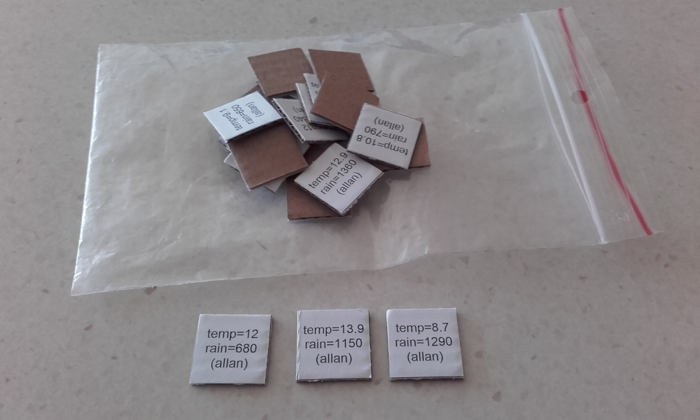
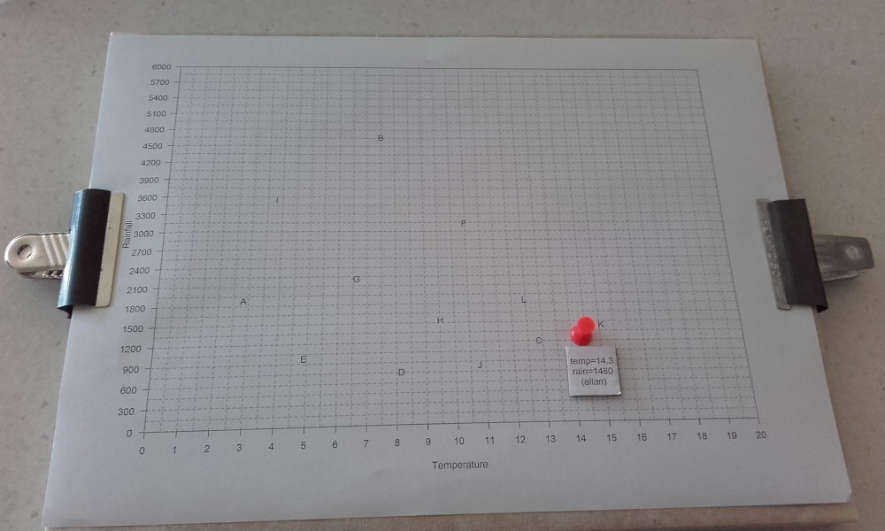
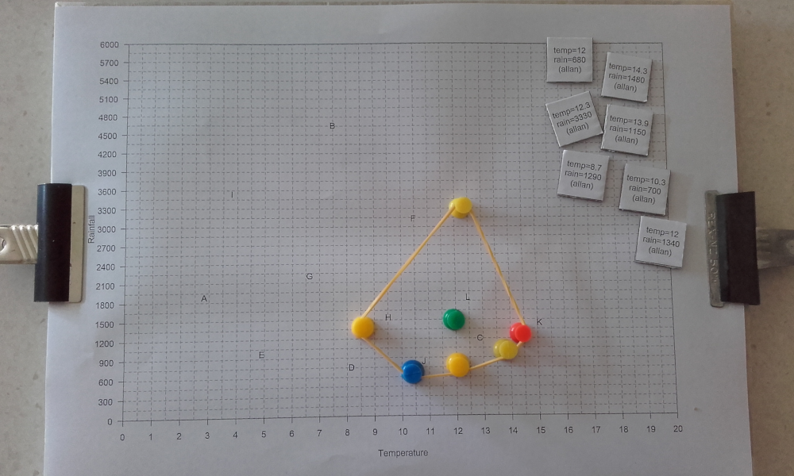
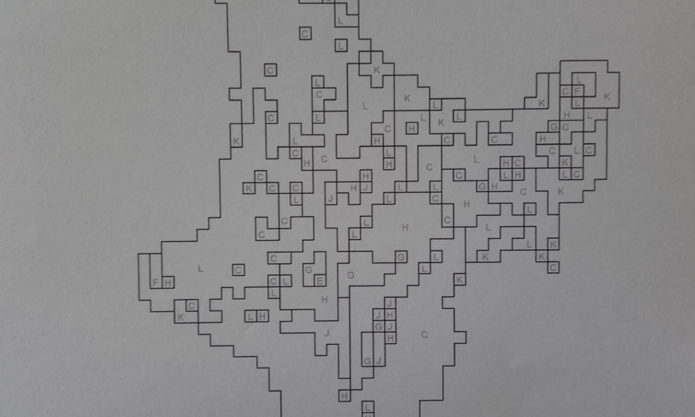
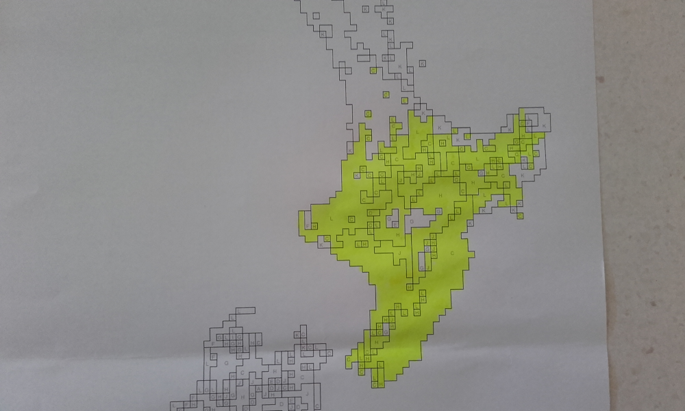

Our [project team](web/about.md) is developing a fun, educational, tabletop game based on real data from [natural history collections](https://en.wikipedia.org/wiki/Scientific_collection) and that applies the same mathematical methods used by scientists to estimate the [ecological niche](https://en.wikipedia.org/wiki/Ecological_niche) of plants or animals to create [species distribution maps](https://en.wikipedia.org/wiki/Species_distribution) that show climatically suitable areas where that species could live now and under different possible futures.

## How it works

### Step 1

You begin with a bag of data tokens.  These are **actual** data from collections available in the [Global Biodiversity Information Facility](https://www.gbif.org/).  In the picture you can see data for radiata pine (_Pinus radiata_) recorded in the Manaaki Whenua's [Allan Herbarium](https://www.landcareresearch.co.nz/tools-and-resources/collections/allan-herbarium/), but there is nothing to stop using data for any species in any available collection.

### Step 2

You then randomly select a data token, and mark the data point on your niche board.

### Step 3

You then continue to collect data to build up a sample, and then you put an elastic band around the data points to create a [convex hull](https://en.wikipedia.org/wiki/Convex_hull) that defines the [ecological niche](https://en.wikipedia.org/wiki/Ecological_niche) of the species.  Everywhere inside the elastic band should be a suitable climatic condition for the species.

### Step 4

At this point you should note the letters on the niche board.  These relate to clusters of **actual** climatic conditions we find here in Aotearoa New Zealand.  You can see these letters on this map of the central Te Ika-a-Māui North Island.

### Step 5

You can then start to colour in all the areas that have a letter that is within the niche to start to build up a picture of where a species could occur.

## What you can learn from this

There are lots of ways to apply this basic process to learn about climate change and species distributions.  You can change species of course, and the natural history collections you might want to highlight.  You could also have maps for more specific regions, say just Auckland or just Canterbury.  You could also have a matching map of future climates so you can assess how a species’ distribution might change in the future under climate change.  You could also look at this from the perspective of where invasive species might spread, or where native species could be reintroduced.  You could even get more advanced by looking at data issues around the effect of sample sizes and outliers in terms of how confident you are in your predictions.  Loads of options – almost too many really!
